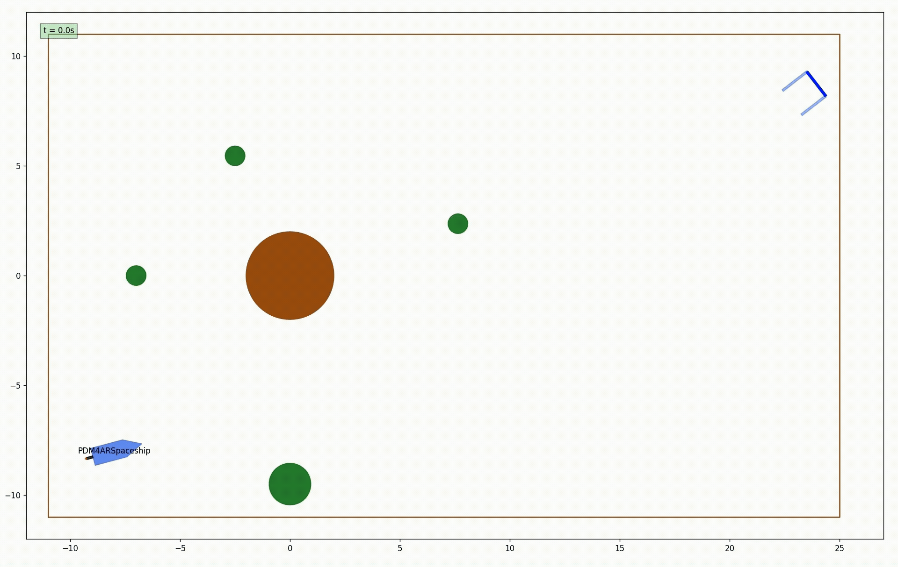
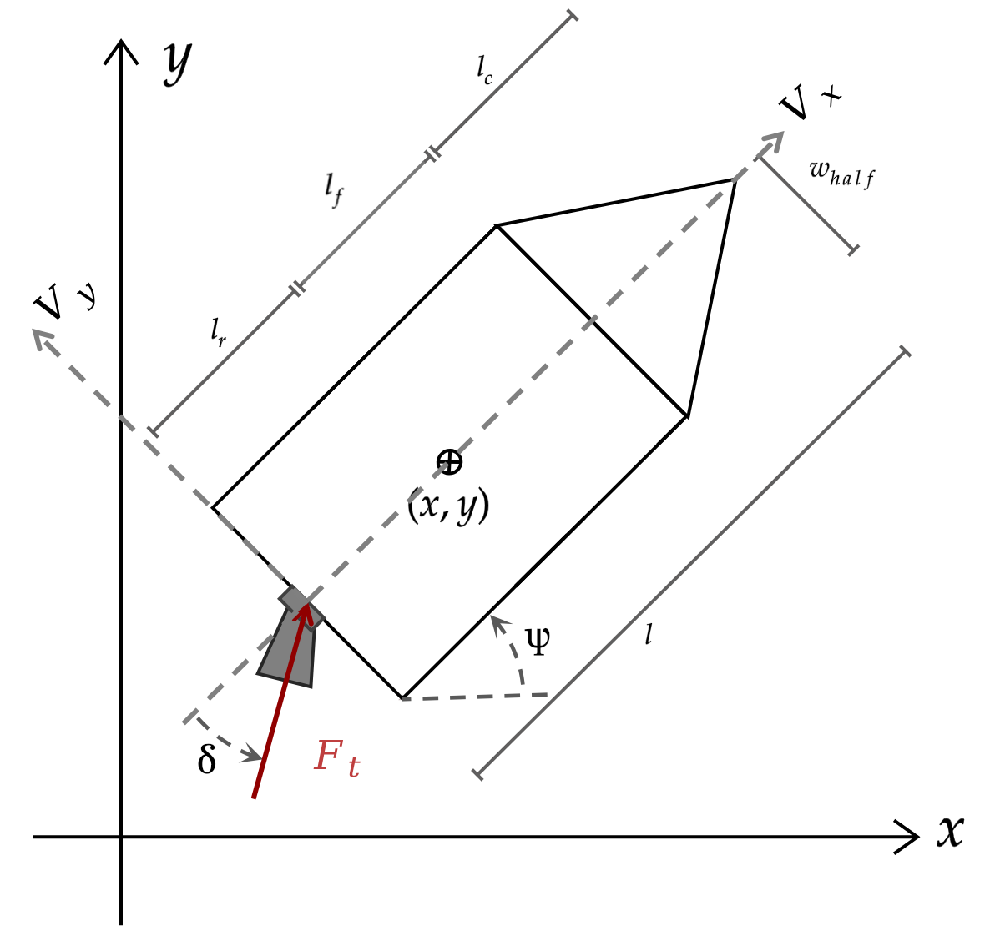
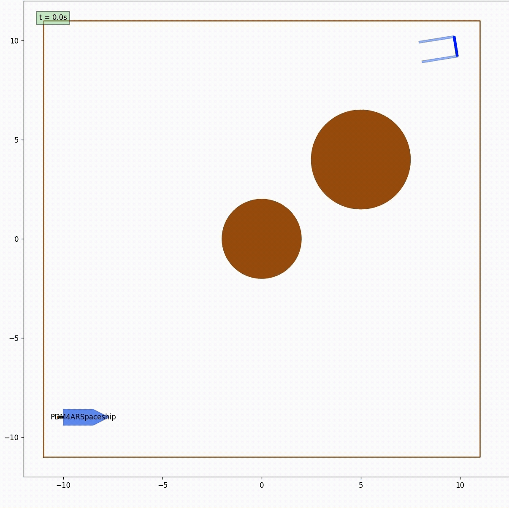
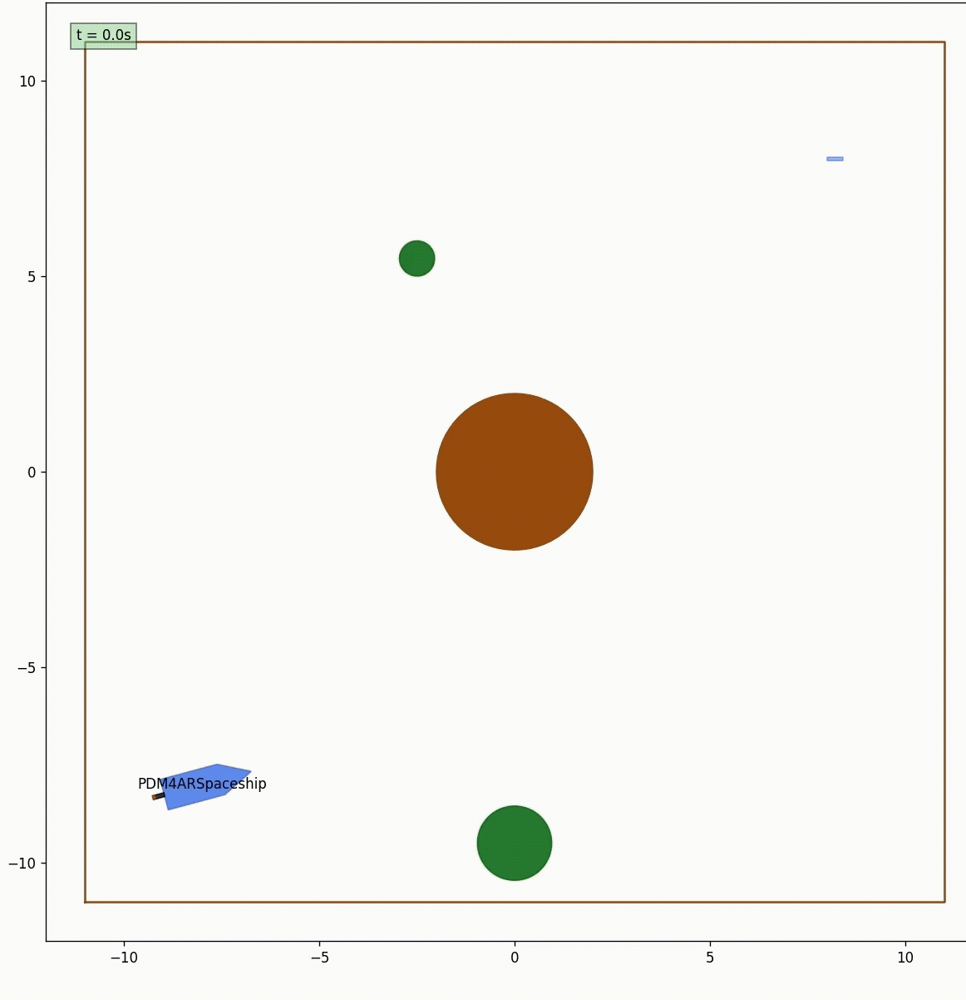

# Convex Optimization for Spaceship Trajectory Generation🚀

This project has been developed during the course Planning and Decision Making for Autonomous Robots (PDM4AR) at ETH Zurich.

This exercise tackles a complex problem in space exploration - navigating and docking a spaceship through challenging space environments.
The goal is to reach the predefined target location using the available thruster of the spaceship, which force and direction can be controlled. 
The entire planning stack has been implemented using sequential convex optimization and cvxpy as optimization tool.

## Spaceship dynamics
The spaceship's dynamics are represented by the following equations. 
Note that the pose is expressed in global frame, while the velocities are expressed in the spaceship frame.

1. **Position Dynamics:**
    - $\frac{dx}{dt} = v_x \cos(\psi) - v_y \sin(\psi)$
    - $\frac{dy}{dt} = v_x \sin (\psi) + v_y \cos(\psi)$

2. **Orientation Dynamics:**
    - $\frac{d\psi}{dt} = \dot{\psi}$

3. **Fuel Dynamics:**
    - $\frac{dm}{dt} = -C_T * F_{thrust}$

4. **Velocity Dynamics:**
    - $\frac{dv_x}{dt} = \frac{1}{m} \cos(\delta)F_{thrust} + \dot{\psi} v_y$
    - $\frac{dv_y}{dt} = \frac{1}{m} \sin(\delta)F_{thrust} - \dot{\psi} v_x$

5. **Angular Velocity Dynamics:**
    - $\frac{d\dot{\psi}}{dt} = - \frac{l_r}{I}\sin(\delta)F_{thrust}$
    - $\frac{d\psi}{dt} = v_{\delta}$

If the spaceship's state is represented by $X = [x, y, \psi, v_x, v_y, \dot{\psi}, \delta, m]'$, and the control inputs 
are $U = [F_{thrust}, \dot{\delta}]$, we obtain the following dynamics equations:

6. **Dynamics:**
    - $\frac{dX(t)}{dt} = f(X(t), U(t))$

The spaceship you have the control over has one central thruster where you are able to control the amount of thrust to
produce $F_{thrust}$ and the angle of the thruster with respect to the spaceship $\delta$. The thruster is mounted centrally on the spaceship
with an offset of $l_r$ to the CoG of the spaceship. The velocity $v_x$ and $v_y$ are the velocities in the x and y
direction of the spaceship frame respectively. The angle $\psi$ is the angle of the spaceship with respect to the x-axis. The length of the spaceship is $l$.

## Constraints

There are several constraints that need to be satisfied, [$x_0, y_0$] is the starting location and [$x_1, y_1$] is the goal location:

- The initial and final inputs needs to be zero: $U(t_0) = U(t_f) = 0$
- The spaceship needs to arrive close to the goal  
  $\left\lVert (x(t_{\mathrm{f}}), y(t_{\mathrm{f}})) - (x_{1}, y_{1}) \right\rVert_{2} < \epsilon_A$
- with a specified orientation.
    - $\left\lVert \psi(t_f) - \psi_{\text{1}} \right\rVert _{1} < \epsilon_A$
- The spaceship's final velocity must be close to the goal velocity  
  $\left\lVert (v_x(t_f), v_y(t_f)) - (v_{x,1}, v_{y,1}) \right\rVert_{2} < \epsilon_A$
- The spaceship needs to dodge every obstacle in its path: $(x, y) \bigoplus \mathcal{X}_{Rocket}(\psi) \notin Obstacle
  \quad \forall Obstacle \in Obstacles$
- The spaceship's mass should be greater than or equal to the mass of the spaceship without fuel: $m(t) \geq m_
  {spaceship} \quad \forall t$
- Control inputs, $F_{thrust}$ is limited: $F_{thrust} \in [-F_{\text{max}}, F_{\text{max}}]$.
- The thrust angle is limited: $\delta
  \in [-\delta_{\text{max}}, \delta_{\text{max}}]$.
- You have a maximum time to reach the goal position: $t_f \leq t_f^{max}$
- The rate of change of $\phi$ is limited: $v_\phi \in [-v^{max}_ϕ ,v^{max}_ϕ ]$

## Code Structure

The various data structures needed for the development of the exercise can be inspected in the following files:

- **agent.py**: Interface with the simulator.
- **planner.py**: SCvx skeleton.
- **spaceship.py**: Helper file for transfer of dynamics between the planner and discretization.
- **discretization.py**: ZeroOrderHold and FirstOrderHold Implementation for convexification.

## Additional Videos

<table>
  <tr>
    <td></td>
    <td></td>
  </tr>
</table>
